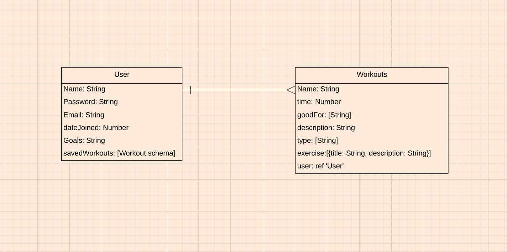

## XRSZ App
This project was made for people who have a hard time staying active during these tough times. You don't need a gym or a lot of weights to stay active. Physical activity and exercise can have immediate and long-term health benifits, but most importantly it can give you more energy and improve your everyday life. 

<a href="https://xrszworkout.herokuapp.com/">XRSZ Website</a>

### `Technologies Used`
HTML, CSS, Semantic-UI-React, NodeJS, MonogoDB, React

### `Unsolved Problems`
- Save button on each workout to profile 
- Randomizer button that pics workout for you 
- Like workouts 

### Dependencies 
- axios
- body parser 
- cors 
- dot env
- mongoose 
- express validator and jwt 
- uuid
- moment 
- react-moment 

### `Wire Frames/User stories`

### `installation steps`

- Run npm install for dependencies 
- npm start for front-end
- run nodemon for backend 

#### By Myles Richard
